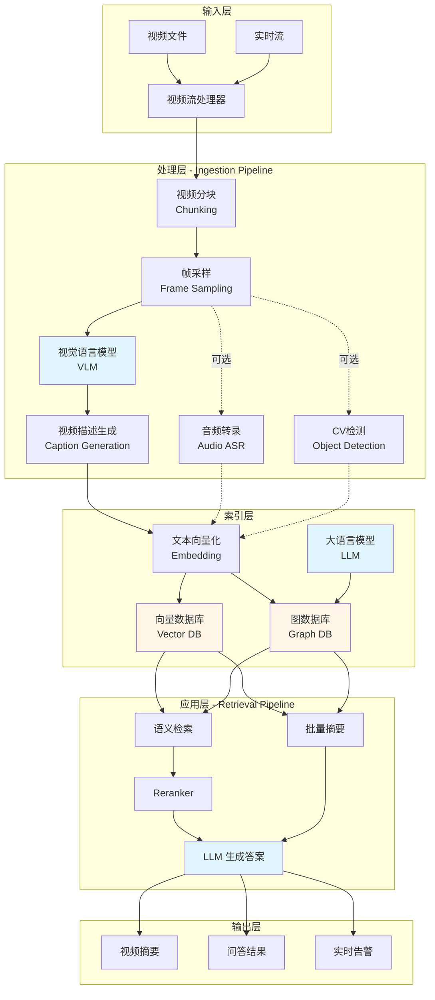

# 视频智能分析系统 - 架构说明

## 系统架构图



## 架构说明（含技术栈）

### 1. 输入层

| 功能 | 技术实现 | 说明 |
|------|---------|------|
| **视频文件** | MP4/AVI/MOV/WebM | 支持常见视频格式，离线批量处理 |
| **实时视频流** | RTSP/HLS/RTMP | 接入监控摄像头、直播流等实时源 |
| **视频解码** | FFmpeg/GStreamer | 硬件加速解码，支持 H.264/H.265 |

---

### 2. 处理层（Ingestion Pipeline）

| 功能 | 技术实现 | 配置参数 |
|------|---------|---------|
| **视频分块** | FileSplitter | 默认 10-30 秒/块，可配置 `CHUNK_SIZE` |
| **帧采样** | VideoFileFrameGetter | 8-10 帧/块，智能关键帧提取 |
| **视觉语言模型 (VLM)** | **Qwen-VL-Plus** (阿里云 API) | 多模态理解，生成视频描述 |
| | 支持：Cosmos-Reason1, NVILA, GPT-4o | 可替换为其他 OpenAI 兼容模型 |
| **音频转录** | Riva ASR / Whisper | 可选，语音转文字，支持多语言 |
| **CV 物体检测** | **Grounding DINO** + TensorRT | 可选，开放词汇物体检测 |
| | DeepStream NvDCF Tracker | 跨帧物体追踪，分配唯一 ID |
| **加速推理** | CUDA/TensorRT | GPU 并行处理，支持 FP16/INT8 量化 |

**VLM 示例输出**：
```
"0:00-0:10: 仓库内，一名工人在搬运箱子，未佩戴安全帽，
 背景可见叉车和货架。工人从左侧移动到中央区域。"
```

#### 💡 CV检测方案对比：YOLO vs Grounding DINO

| 对比维度 | YOLOv8 | Grounding DINO ⭐（本项目采用）|
|---------|--------|-------------------------------|
| **检测方式** | 固定类别检测 | 文本引导检测 |
| **类别数量** | 80 类（COCO）| 无限制（开放词汇）|
| **使用方式** | 只能检测训练时见过的类别 | 用中文/英文描述即可检测 |
| **灵活性** | ❌ 新类别需重新训练 | ✅ 零样本检测，无需训练 |
| **速度** | ⚡ 非常快（100+ FPS）| 🐢 较慢（10-30 FPS）|
| **精度** | ⭐⭐⭐⭐ | ⭐⭐⭐⭐ |
| **部署难度** | 简单 | 中等 |
| **适合场景** | 实时监控（固定目标）| 灵活场景（多变目标）|

**典型场景对比**（一目了然）：

| 检测场景 | YOLOv8 | Grounding DINO |
|---------|--------|----------------|
| 检测"人" | ✅ 可以 | ✅ 可以 |
| 检测"未戴安全帽的人" | ❌ 无法识别 | ✅ 可以 |
| 检测"正在掉落的箱子" | ❌ 无法识别（只能识别"箱子"）| ✅ 可以 |
| 检测新品牌叉车 | ❌ 需要重新训练模型 | ✅ 直接描述即可 |
| 检测"穿红色衣服的工人" | ❌ 只能检测"人" | ✅ 可精确识别 |

**代码使用对比**：

```python
# YOLOv8 - 只能检测固定类别
results = yolo.detect(image)
# 输出：[person, car, dog, ...]  ❌ 无法检测"未戴安全帽的工人"

# Grounding DINO - 灵活的文本描述
prompts = ["未戴安全帽的工人", "正在掉落的箱子", "某某品牌叉车"]
results = dino.detect(image, text=prompts)
# 输出：精确定位每个文本描述的物体 ✅
```

**为什么选择 Grounding DINO？**

1. ✅ **灵活性第一** - 监控场景需求多变，随时调整检测目标
2. ✅ **零样本能力** - 无需收集数据重新训练
3. ✅ **语义理解** - 可以检测复杂描述（如"未戴安全帽"、"异常行为"）
4. ✅ **与 VLM 互补** - VLM 生成描述，DINO 做精确定位

**性能优化**：
- 使用 **TensorRT** 加速推理（速度提升 2-3 倍）
- **批量处理** 多帧，充分利用 GPU
- **异步处理** CV Pipeline，不阻塞主流程

---

### 3. 索引层

| 功能 | 技术实现 | 说明 |
|------|---------|------|
| **文本向量化** | **Qwen3-Embedding-0.6B** | 将描述转为 768 维向量 |
| | 支持：BGE-M3, text-embedding-3 | 兼容 OpenAI Embedding API |
| **向量数据库** | **Milvus 2.5.4** | 存储和检索 embedding，支持 ANN 搜索 |
| | IVF_FLAT / HNSW 索引 | 百万级向量毫秒级查询 |
| **图数据库** | **Neo4j 5.26.4** | 存储实体关系和时序图谱 |
| | Cypher 查询语言 | 支持多跳推理和路径查询 |
| **LLM 解析器** | **DeepSeek-V3** | 从文字提取实体、关系、时间 |
| | 支持：Llama 3.1, GPT-4 | 构建知识图谱 (Entity Extraction) |

**LLM 提取示例**：
```
输入：VLM 描述
输出：
  实体: [工人-Person, 箱子-Object, 安全帽-SafetyEquipment]
  关系: (工人)-[搬运]->(箱子)
       (工人)-[未佩戴]->(安全帽)
  时间: 0:00-0:10
  位置: 仓库中央区域
```

---

### 4. 应用层（Retrieval Pipeline）

| 功能 | 技术实现 | 说明 |
|------|---------|------|
| **混合检索** | Vector Search + Graph Search | 语义相似度 + 时序因果关系 |
| **向量检索** | Milvus cosine similarity | Top-K 相似向量召回 |
| **图谱检索** | Neo4j Cypher 查询 | 时间线、因果链、实体关系 |
| **重排序 (Reranker)** | **BGE-Reranker-v2-M3** | 对候选结果精排，提升准确率 |
| | Cross-Encoder 架构 | 比向量检索更精准 |
| **LLM 生成** | **DeepSeek-V3** | 基于检索上下文生成答案 |
| | 支持：Qwen, Llama, GPT-4 | 多轮对话、Chain-of-Thought |

**检索流程**：
```
用户问题 → 向量化 → Milvus 检索(Top 20)
                  ↓
         + Neo4j 图谱查询(相关实体)
                  ↓
              Reranker(Top 5)
                  ↓
         LLM 生成(上下文 + 问题)
                  ↓
              最终答案
```

---

### 5. 输出层

| 功能 | 技术实现 | 应用场景 |
|------|---------|----------|
| **视频摘要** | LLM 批量摘要 + 聚合 | 长视频快速浏览，生成时间轴 |
| **智能问答** | RAG (检索增强生成) | "哪些人未戴安全帽？" |
| **实时告警** | 事件检测 + SSE 推送 | 异常行为实时通知 |
| **API 接口** | OpenAI 兼容 REST API | `/v1/chat/completions` |
| **Web UI** | Gradio 前端 | 可视化交互界面 |

---

## 技术亮点

### 1. 多模态融合
- **视觉 + 语言**：VLM 多模态理解
- **音频 + 文本**：语音转录增强语义
- **CV 辅助**：物体检测提供精确定位

### 2. 混合检索架构
- **向量检索**：语义相似度匹配（快速召回）
- **图谱检索**：时序因果推理（精准理解）
- **Reranker**：二次精排（提升准确率）

### 3. 性能优化
- **GPU 并行**：多卡分布式处理
- **TensorRT 加速**：模型推理加速 10x+
- **增量索引**：支持流式处理

### 4. 灵活扩展
- **OpenAI 兼容 API**：可对接任意模型
- **模块化设计**：各组件独立替换
- **多部署拓扑**：从单卡到多卡集群

---

## 核心应用场景：侦查办案视频分析

### 业务痛点
- 📹 **海量视频**：案件视频数十GB，人工查看耗时数天
- 🔍 **查找困难**：关键线索隐藏在某几秒画面中
- 🧩 **串并复杂**：多路监控需要人工关联分析
- ⏰ **效率低下**：只能按时间快进，无法语义检索

### 解决方案
- ⚡ **快速摘要**：10小时视频 → 5分钟浏览完
- 💬 **语义检索**：直接问"红色轿车何时出现？"
- 🕸️ **时空串并**：自动关联跨摄像头对象轨迹
- 🤖 **智能问答**："嫌疑人案发前后去了哪里？"

### 核心价值
- ✅ 分析效率：数天 → 数小时（**10倍提升**）
- ✅ 线索发现：AI辅助发现遗漏信息
- ✅ 多维关联：自动构建时空关系网络

---

## 其他典型应用场景

### 1. 智慧交通管理
**核心需求**：路口监控视频检索、交通违章智能识别  
**典型问答**："今日 G318 国道是否有货车违规超载？" "上午 10 点路口闯红灯的白色 SUV 车牌号是？"  
**价值**：自动化违章取证，减少人工巡查工作量

### 2. 企业安全合规
**核心需求**：工厂/仓库监控视频归档、安全事故溯源  
**典型问答**："本周是否有员工未佩戴安全帽？" "昨日叉车在 3 号库区的活动轨迹？"  
**价值**：合规审计自动化，快速定位安全隐患

### 3. 视频素材智能管理
**核心需求**：影视/广告公司海量素材检索、快速剪辑  
**典型问答**："找出所有日落海边镜头" "包含产品特写的片段有哪些？"  
**价值**：素材检索从"翻找"变为"对话"，剪辑效率大幅提升

### 4. 医疗教学辅助
**核心需求**：手术视频知识库、临床案例检索  
**典型问答**："腹腔镜手术中如何处理出血？" "类似病例的手术方案对比"  
**价值**：加速医学培训，辅助临床决策

### 5. 智能监控预警
**核心需求**：实时流分析、异常事件自动告警  
**典型问答**："监测到陌生人进入禁区立即告警" "检测烟雾/火光自动通知"  
**价值**：7×24 小时智能值守，异常事件秒级响应

---

## 核心技术栈总览

### AI 模型层
| 类型 | 当前使用 | 可替换选项 |
|------|---------|-----------|
| VLM | Qwen-VL-Plus | Cosmos-Reason1, GPT-4o, NVILA |
| LLM | DeepSeek-V3 | Qwen, Llama 3.1, GPT-4 |
| Embedding | Qwen3-Embedding | BGE-M3, text-embedding-3 |
| Reranker | BGE-Reranker-v2 | ColBERT, Cross-Encoder |
| CV 检测 | Grounding DINO | YOLO, SAM, DINO |

### 数据存储层
| 组件 | 版本 | 用途 |
|------|------|-----|
| Milvus | 2.5.4 | 向量数据库 (ANN 搜索) |
| Neo4j | 5.26.4 | 图数据库 (知识图谱) |
| ArangoDB | 3.12.4 | 多模型数据库 (文档+图) |
| MinIO | latest | 对象存储 (视频/缓存) |

### 推理加速层
- **CUDA**：GPU 加速计算
- **TensorRT**：深度学习推理优化
- **DeepStream**：视频分析流水线
- **GStreamer**：视频处理管道

### API & 接口层
- **OpenAI 兼容 API**：`/v1/chat/completions`, `/v1/embeddings`
- **RESTful API**：文件上传、流管理、问答接口
- **WebSocket/SSE**：实时事件推送
- **Gradio UI**：Web 可视化界面

